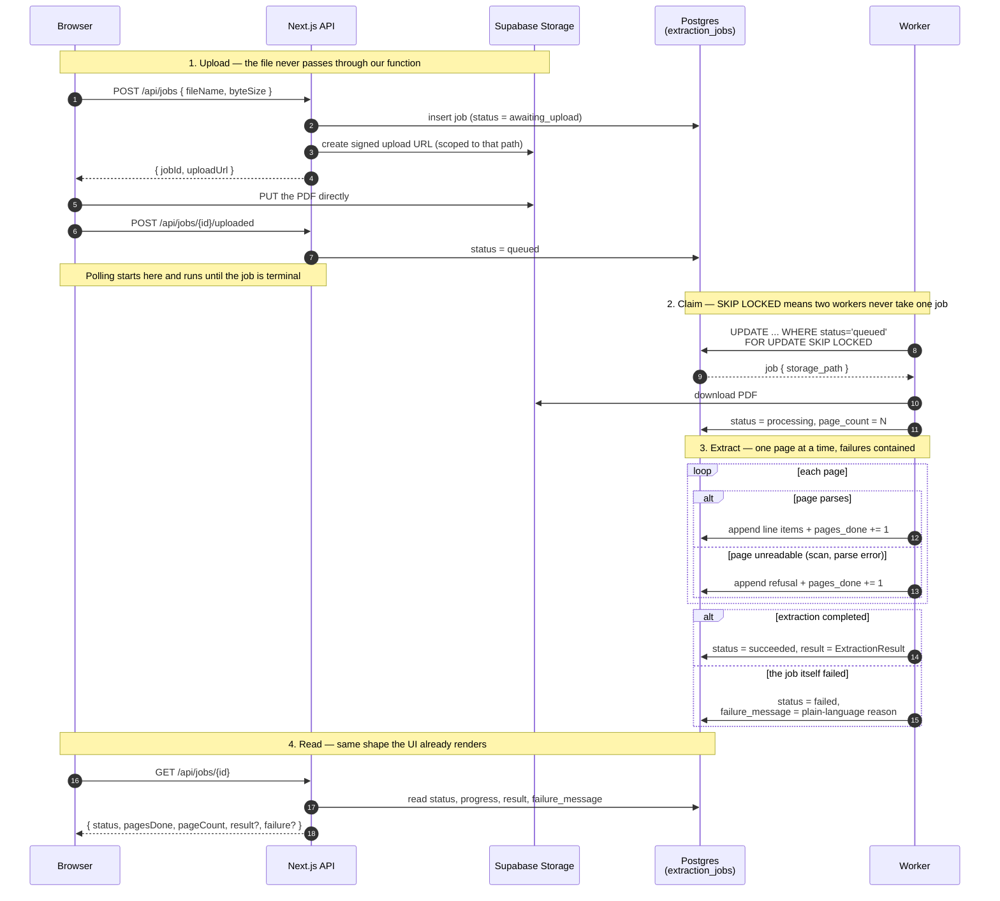

# Handling large documents: storage, jobs and a worker

**Status:** proposed, not built. This documents the approach before writing any
of it.

Today extraction is synchronous: the browser posts a PDF to
[`/api/extract`](../app/api/extract/route.ts), the route holds the request open
while every page is parsed, and the JSON comes back on the same connection.
That is the right shape for a 2 KB docket. It stops working as files grow.

---

## What actually breaks

Four separate ceilings, in the order a growing file hits them:

| # | Ceiling | Where | What the user sees |
|---|---|---|---|
| 1 | **Request body limit** | Vercel caps serverless request bodies at roughly 4.5 MB | Upload rejected by the platform before our own code runs — so our friendly `FILE_TOO_LARGE` message never fires |
| 2 | **Function timeout** | [`maxDuration = 60`](../app/api/extract/route.ts:16) | Connection dies mid-parse; no partial result, no reason |
| 3 | **Memory** | [`await file.arrayBuffer()`](../app/api/extract/route.ts:67) loads the whole PDF, then [`readPages`](../lib/extract/pdf.ts:35) holds every page's cells at once | Function OOMs |
| 4 | **No progress** | Single request/response | Browser sits on a spinner for minutes with nothing to show |

Ceiling 1 is the important one and the least obvious. Our
[`MAX_BYTES = 25 MB`](../app/api/extract/route.ts:18) check is, on Vercel,
unreachable — the platform refuses the body first. That is exactly the failure
mode this project is about: a real, specific reason (*"your file is too big"*)
getting replaced by a generic platform error on the way out.

> Verify the current Vercel body and duration limits before building against
> them; they change, and Fluid compute shifts the duration ceiling.

---

## The approach

Three changes, each removing one ceiling:

1. **The file never goes through the API.** The browser asks for a signed
   upload URL and PUTs the PDF straight into a Supabase Storage bucket.
   Ceiling 1 disappears, because our function only ever handles a few hundred
   bytes of JSON.
2. **Extraction moves to a worker.** A row in a `extraction_jobs` table is the
   queue. A worker claims it, downloads from the bucket, and runs the existing
   engine. Ceilings 2 and 3 disappear, because the worker is not a request.
3. **The browser polls for status.** It gets `pages_done / page_count` while
   the work happens. Ceiling 4 disappears.

The extraction engine itself does not change. Everything in
[`lib/extract/`](../lib/extract) is plain TypeScript whose only dependency is
`pdfjs-dist`, so the worker imports it exactly as the route does today. The
tested behaviour carries over untouched.

### Sequence



### Job states

```
awaiting_upload ──> queued ──> processing ──> succeeded
                                          └─> failed
```

`awaiting_upload` exists because the row is created before the file arrives. An
abandoned upload leaves a stranded row, so it needs an expiry sweep — see
[open questions](#open-questions).

---

## Schema sketch

```sql
create table extraction_jobs (
  id              uuid primary key default gen_random_uuid(),
  storage_path    text not null,
  file_name       text not null,
  byte_size       bigint not null,

  status          text not null default 'awaiting_upload',
  page_count      int,
  pages_done      int  not null default 0,

  -- the ExtractionResult, written once on success
  result          jsonb,

  -- a refusal-shaped failure: code plus the sentence a person reads
  failure_code    text,
  failure_message text,

  attempts        int not null default 0,
  created_at      timestamptz not null default now(),
  started_at      timestamptz,
  finished_at     timestamptz
);

create index on extraction_jobs (status, created_at)
  where status in ('queued', 'processing');
```

Claiming a job, which is the whole queue:

```sql
update extraction_jobs
   set status = 'processing', started_at = now(), attempts = attempts + 1
 where id = (
   select id from extraction_jobs
    where status = 'queued'
    order by created_at
    for update skip locked
    limit 1
 )
returning *;
```

**Why a table and not a queue product.** Supabase offers Queues (pgmq), and it
is the better answer at real throughput. For one worker and a handful of
concurrent uploads, `FOR UPDATE SKIP LOCKED` is a correct queue with no extra
infrastructure, and it is transactional with the job data itself — the claim
and the state live in one row. Worth revisiting when there is more than one
worker or retry semantics get complicated.

---

## The part that is easy to get wrong

Adding a queue adds two more layers a refusal has to survive: the job row, and
the polling endpoint. Both are places where *"page 4 is a scan we cannot read"*
becomes *"job failed"*.

Three rules keep the existing contract intact:

**A refused page is not a failed job.** Per-page containment already exists in
[`parseOnePage`](../lib/extract/extract.ts:103) — a page that throws becomes a
refusal while the others carry on. A job whose pages were all refused is
`succeeded` with a result full of refusals, not `failed`. `failed` means we
never got to look at the document at all. This is the same distinction the HTTP
layer already makes between a 200-with-refusals and a 4xx.

**`failure_message` is written where the failure happens.** Same rule as
`Refusal.humanMessage` — the worker writes the sentence, because the worker is
where the context exists. The polling endpoint passes it through and the UI
renders it verbatim. No layer summarises it.

**A stuck job has to say so.** A worker that dies mid-page leaves a row in
`processing` forever. A job in `processing` past a timeout must be reaped into
`failed` with a real explanation (*"extraction stopped partway through page 12
and did not resume"*), not left spinning in the browser. A silent hang is the
worst version of a generic error.

---

## What changes in the existing code

Small, and mostly additive:

| Area | Change |
|---|---|
| [`lib/extract/`](../lib/extract) | **None.** Imported by the worker unchanged |
| [`app/api/extract/route.ts`](../app/api/extract/route.ts) | Keep for small files, or retire once jobs work |
| New routes | `POST /api/jobs`, `POST /api/jobs/{id}/uploaded`, `GET /api/jobs/{id}` |
| New worker | Claims jobs, downloads, calls `extract()`, writes back |
| [`app/page.tsx`](../app/page.tsx) | Upload becomes request-URL → PUT → poll; `State` gains a `queued`/`processing` case with progress |
| [`ResultView`](../app/components/ResultView.tsx) | **None.** It renders an `ExtractionResult`, which is what the job produces |

The UI's existing `State` union is already the right shape — it grows one
variant rather than being restructured.

### Where the worker runs

| Option | Trade-off |
|---|---|
| **Long-running Node process** (Railway, Fly, Render) | Recommended. No timeout, imports `lib/extract` as-is, easiest to reason about |
| **Vercel Cron → API route** | No new infrastructure, but still bounded by function duration, so it must process a page or a chunk per invocation |
| **Supabase Edge Function** | Closest to the data, but Deno — `pdfjs-dist` compatibility needs proving before committing |

---

## What this does *not* fix

Honest limits of the design above:

- **A single enormous page still has to fit in memory.** Streaming helps across
  pages, not within one. A 200 MB scanned drawing is still a problem.
- **No resumability.** A worker that dies at page 180 of 200 restarts from
  page 1. Fixing that means per-page result rows rather than one `result` blob
  — worth doing when documents get long enough to make the restart expensive,
  and it also gives incremental rendering for free.
- **Still no OCR**, so bigger scanned files just mean more refusals, faster.
- **No back-pressure.** Nothing stops a hundred uploads queueing at once.
- **Storage costs and retention.** Customer PDFs now persist in a bucket rather
  than living for one request. That is a data-retention decision, not just an
  engineering one.

---

## Open questions

1. **Who marks the upload complete** — the browser calling
   `/uploaded`, or a Supabase Storage webhook? The webhook is more reliable
   (survives the browser closing mid-upload) but is more config. The browser
   call is simpler and needs the expiry sweep either way.
2. ~~**Polling or Realtime?**~~ **Done.** The browser subscribes to a Realtime
   broadcast channel named after the job id, and the consumer publishes a small
   signal on every transition. Broadcast rather than `postgres_changes`, because
   postgres changes are filtered by RLS and opening the table for reads would
   expose every document's contents to anyone with the publishable key — a
   channel keyed by the job's UUID is capability-based, exactly like the status
   endpoint. A 10s backstop poll remains, and is required rather than
   defensive: broadcasts have no replay, so a message sent before the browser
   subscribed or during a reconnect is simply gone.
3. **How long do PDFs stay in the bucket** after extraction succeeds?
4. **Retry policy.** `attempts` is in the schema but nothing uses it yet. Which
   failures are worth retrying? A corrupt PDF never is; a worker OOM might be.
5. **Auth.** None of this is scoped to a user yet. Signed upload URLs and RLS
   on `extraction_jobs` both need an identity to key off.
